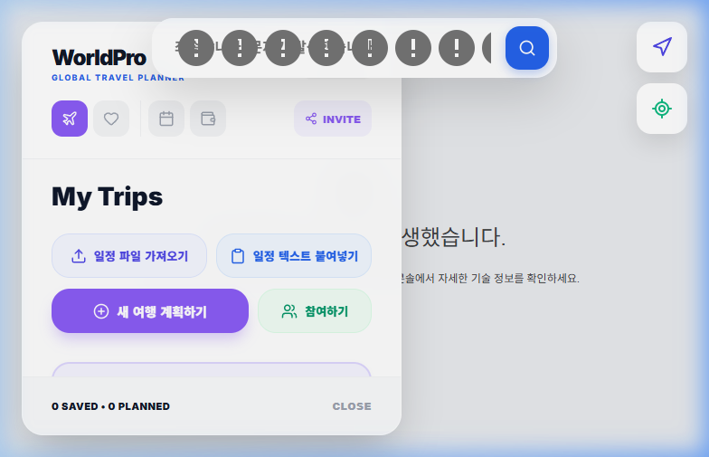
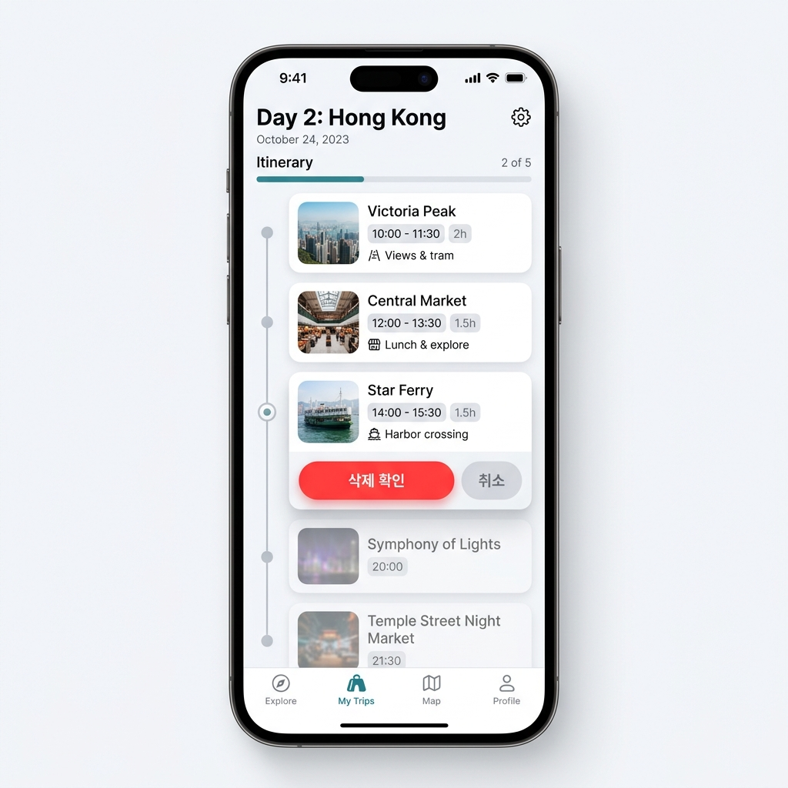
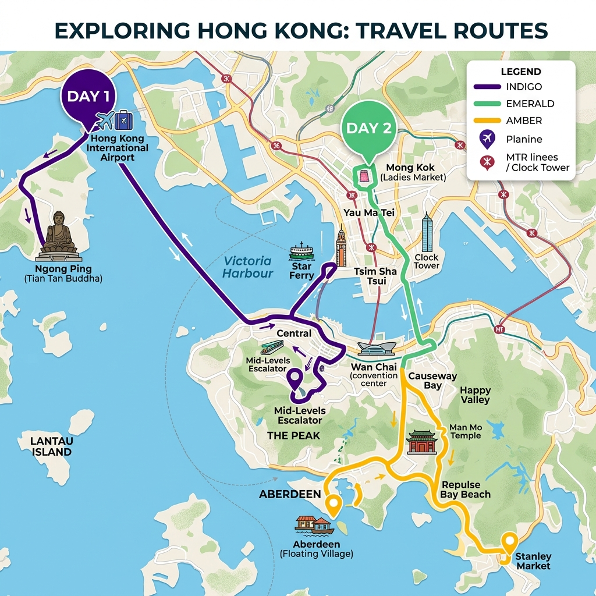

# 📑 웹페이지 상세 설명서: Hong Kong Tour Planner

이 문서는 **Hong Kong Tour Planner**의 디자인 시스템, 주요 기능, UX 흐름 및 기술적 사양을 정의합니다. 디자이너와 개발자가 동일한 시각 가이드를 공유하고 유지보수할 수 있도록 설계되었습니다.

---

## 1. 디자인 시스템 (Design System)

### 🎨 컬러 팔레트 (Color Tokens)
| 구분 | 색상 코드 | 용도 | 비고 |
| :--- | :--- | :--- | :--- |
| **Primary** | `#4F46E5` | 주요 버튼, 활성 상태 | Indigo 600 |
| **Secondary** | `#8B5CF6` | 새 여행 생성 버튼 | Violet 500 |
| **Success** | `#10B981` | 참여하기, 성공 알림 | Emerald 500 |
| **Danger** | `#EF4444` | 삭제 확인 버튼 | Red 500 |
| **Navigation** | `#3B82F6` | 길 찾기, 위치 마커 | Blue 500 |

### 🔡 타이포그래피 (Typography)
*   **Font Family**: `Inter`, system-ui, sans-serif
*   **Header**: 28px, Weight 900 (Black)
*   **Body**: 14px, Weight 700 (Bold)

---

## 2. 주요 화면 상세 (Screen Specifications)

### 2.1 홈 화면 (My Trips)
사용자가 여행 목록을 관리하는 대시보드입니다.

*가이드 이미지: 전체적인 홈 화면 콘셉트*

*   **주요 기능**:
    *   **일정 파일 가져오기**: JSON 형식의 데이터를 업로드하여 복원.
    *   **텍스트 붙여넣기**: 텍스트 데이터를 파싱하여 즉시 일정 생성.
    *   **새 여행 계획하기**: 여행 이름, 기간, 국가를 설정하여 새로운 여정 시작.

*실제 스크린샷: 홈 화면 레이아웃*

### 2.2 일정 편집 (Itinerary Planner)
세부 장소를 추가하고 시간을 조율하는 공간입니다.

*가이드 이미지: 일정 카드 및 삭제 확인 로직*

*   **스마트 삭제 확인**: 쓰레기통 버튼을 누르면 '삭제 확인' 버튼이 나타나며, 붉은색 강조와 그림자 효과로 사용자 실수를 방지합니다.
*   **시간 관리**: 각 장소의 시간을 클릭하여 수정할 수 있으며, 위아래 화살표로 순서를 변경합니다.

---

## 3. 지도 시각화 및 내비게이션 (Map & Nav)

### 3.1 전체 경로 시각화 (Full Route)
여행의 모든 일정을 하나의 흐름으로 연결합니다.

*가이드 이미지: 날짜별 경로 및 화살표 가이드*

*   **시각화 요소**:
    *   **날짜별 색상**: 각 일차별로 고유 색상 부여 (예: Day 1 보라, Day 2 초록).
    *   **연결선(Bridge)**: 날짜 사이를 옅은 점선으로 연결하여 연속성 부여.
    *   **방향성 화살표**: 경로 위에 이동 방향을 나타내는 화살표 자동 배치.

### 3.2 내 위치 찾기 (My Location)
사용자의 현재 위치를 실시간으로 추적합니다.

*가이드 이미지: 블루 닷 마커 및 위치 버튼*

*   **블루 닷(Blue Dot)**: 맥동(Pulse) 애니메이션이 적용된 SVG 마커로 현재 위치 표시.
*   **조준 버튼**: 지도 우측 상단 전용 버튼 클릭 시 현재 위치로 지도 중앙 정렬.

---

## 4. 기술 사양 (Tech Stack)
*   **Framework**: React 19, Vite
*   **Map API**: Google Maps JavaScript API (@react-google-maps/api)
*   **Icons**: Lucide-React
*   **Styling**: TailwindCSS & Inline CSS (for precision)
*   **Deployment**: Cloudflare Pages

---
*마지막 업데이트: 2026-05-10*
